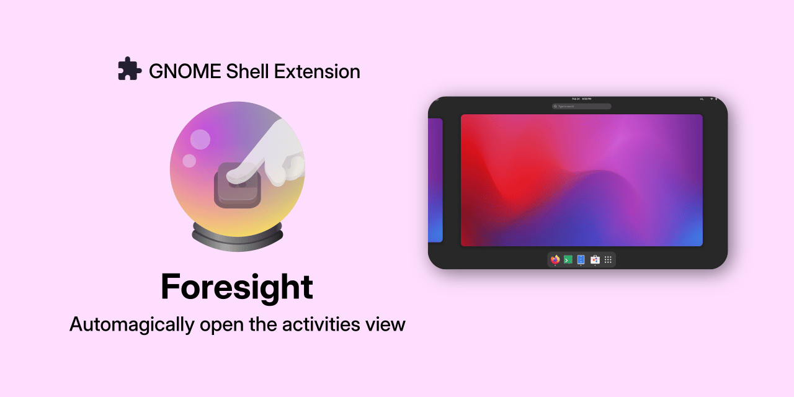

Foresight is a GNOME Shell Extension that automagically opens the activities view on empty workspaces. It uses callbacks to monitor windows and workspaces (instead of actively checking on them on certain time intervals), which makes it very efficient and responsive.

## Getting started

### Installation

You can install Foresight using the GNOME Extensions website.

<a href="">
  
</a>

Alternatively, you can install it using the [Extension Manager](https://flathub.org/apps/com.mattjakeman.ExtensionManager) app.

### Usage

Simply keep using your desktop ‒ the magic will happen once you get to an empty workspace! There are no preferences to tweak.

Foresight will open the activities view when all windows in a workspace are closed, but also when you switch to an already empty workspace. In case the activities view was activated by Foresight, it will deactivate it once you open a window (that's GNOME default behavior) or switch to a non-empty workspace. Foresight will never deactivate the activities view if it was activated by you.

## FAQ

### How does it work?

Foresight adds callbacks to certain GNOME Shell signals, like `window-removed` and `workspace-switched`. It also keeps track of whether the activities view was activated by itself or by the user. These callbacks then check for the conditions to activate (or deactivate) the overview if needed, for example if the workspace is empty or not.

## Contributing

#### Building and installing from source

If you wish to make changes to the Foresight codebase, you will likely want to build it and install it from source. Foresight's source code on hosted on [GitHub](https://github.com/pesader/gnome-shell-extension-foresight). Your first step is cloning Foresight's repository with:

```bash
git clone https://github.com/pesader/gnome-shell-extension-foresight.git
```

You can then build and install the extension with:

```bash
cd gnome-shell-extension-foresight
make build && make install
```

You can run a nested session of GNOME Shell to test the extension out with:

```bash
make run
```

Before submitting a pull request, make sure you install and run the linter with:

```bash
make lint-install # install the linter
make lint         # run the linter
```

You can also have the linter attempt to fix the errors it found with:

```bash
make lint-fix
```

## Attribution

### Code

- This project is a fork of ["Show Application View When Workspace Empty"](https://github.com/fawtytoo/GnomeShellExtensions/tree/main/show_applications_instead_of_overview%40fawtytoo%20(3.38%E2%80%9343)) by fawtytoo

### Assets

- Logo: based on [Snapshot](https://gitlab.gnome.org/GNOME/snapshot/-/blob/main/data/icons/org.gnome.Snapshot.svg?ref_type=heads), [Snowglobe](https://gitlab.gnome.org/bilelmoussaoui/snowglobe/-/blob/main/data/icons/hicolor/scalable/apps/com.belmoussaoui.snowglobe.svg?ref_type=heads), and art from [gnome.org](https://gitlab.gnome.org/Teams/Websites/www.gnome.org/-/blob/main/img/shell.svg?ref_type=heads)
- Banner: inspired by the banners at [Flathub's home page](https://flathub.org/)
- Extension logo in banner: is the symbolic icon from Matthew Jakeman's [Extension Manager](https://github.com/mjakeman/extension-manager/blob/master/data/icons/com.mattjakeman.ExtensionManager-symbolic.svg)
- EGO banner: modified from [Just Perfection's work](https://gitlab.gnome.org/jrahmatzadeh/just-perfection/-/blob/main/data/imgs/ego.svg?ref_type=heads)

### Build system

- Makefile: inspired by the Makefiles of [Caffeine](https://github.com/eonpatapon/gnome-shell-extension-caffeine/blob/master/Makefile) and [Blocker](https://github.com/pesader/gnome-shell-extension-blocker/blob/main/Makefile)
- GitHub Actions workflow for linting: again, inspired [Caffeine](https://github.com/eonpatapon/gnome-shell-extension-caffeine/tree/master/.github/workflows) and [Blocker](https://github.com/pesader/gnome-shell-extension-blocker/blob/main/.github/workflows/linter.yml)

## Gratitude

This project would not exist if it weren't for "Show Application View When Workspace Empty" by fawtytoo, so I thank its maintainer and all its contributors. I'm also grateful to everyone in the GNOME Extensions matrix room, who kindly answered the many questions that came up while I was writing this program.

## License

This project is licensed under the terms of the [GPLv3](https://www.gnu.org/licenses/gpl-3.0.txt).
